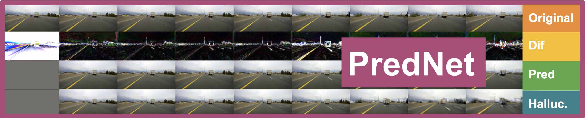

# Visualization

## Visualise maps

+ Visualization script takes `.t7` file as input which was generated using `video2Tensor` script.
+ Set `channel[1]` to 1 if its a gray-scale image and to 3 if its an RGB image.
+ Use `nrow` option to control # of images to show in one row.

Sample command to run the script:

```
qlua visualize.lua --input /dataset.t7 --dmodel /media/HDD1/Models/predNet/ --net 100 --nrow 5
```

## Show predictions

This script shows a row of original images, a row of error images, a next-frame prediction and an hallucination (given a prime of a sequence length).
You can run the script as:

```
qlua view_predictions.lua --input ../utils/testData.t7 --dmodel results/010 --net 20 --nrow 5 --model pred
```


